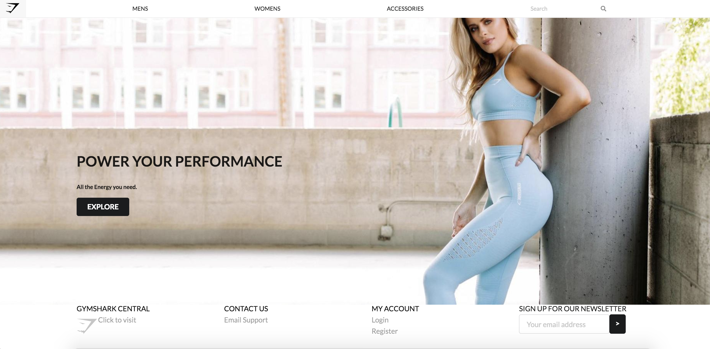

You see that? I made that. Cool right? Needless to say, it’s not great work. The links don’t lead anywhere, 
the icons don’t match the original website’s, and I only managed to recreate part of the original’s website. 
For reference, this is the original website I was inspired by: 

Much nicer, right? You don’t have to be nice about it, I can take criticism. 

Despite my mediocre work, i’m pretty proud of what I accomplished. It may not look like much, but behind the scenes 
it’s a lot of work. In order to create websites, a web designer must understand HTML and CSS. First of all, they have the 
right commands, classes, types, and syntax. They may sometimes spend hours trying to find the right position for an item, 
playing around with padding and margins. Even after all their hard work, they have to worry about their website crashing and 
provide alternatives to images, fonts, and so forth! Thank god for UI frameworks!

## What even is UI frameworks?
UI frameworks make it slightly easier for web designers. Based on HTML, UI frameworks are open sourced and therefore, 
is free to use. Furthermore, UI frameworks allows web designers to create websites even if they do not possess deep knowledge
of HTML yet.

## How do I feel about web design?
I have to be honest. At first, I didn’t expect web design to be tough. I wouldn’t have to deal with logic or loops or math.
It was simply formatting and memorizing the syntax of HTML. Simple right? Boy, was I wrong. Creating a website reminds me of 
when I was really into folding origami. Have you ever tried to fold origami with a rectangular piece of paper instead of a 
perfectly squared one? Yeah, it doesn’t look so great. You have to find the right paper that’s thin enough to fold, 
but thick enough to hold its integrity; you have to align corners almost perfectly to get the right results; you have to
use your nails to make crisp creases. Folding origami takes a lot of precision and time. That’s what web design is like. 
But a lot more harder and time consuming. However, I do find it a bit therapeutic and entertaining, and nothing beats the 
feeling of accomplishment afterwards. 

---
