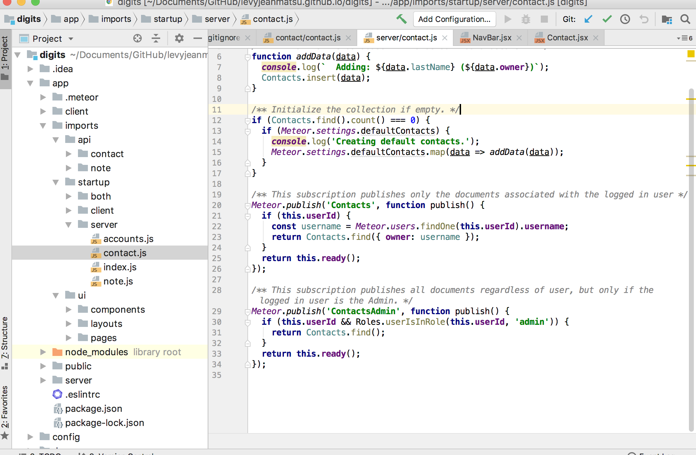

  ### Discovering Design Patterns 

   In my 2018 fall semester and The University of Hawaii at Manoa, I took a software engineering class.
 In the beginning of the semester, we only got a taste of what software engineering is like; we learned functional
 programming, HTML, and UI design. We then created mock up website pages, which were basically just designs of 
 websites that didn’t have the functionality of a web app. All these exercises begged the question, “when are we 
 going to create an actual web app?” I was aching to create something that had more functionality! Right after our 
 first week on Application Design with Meteor, we began to work on a interactive web application named Digits. 
 This application allowed a signed in user to add, save, and edit contacts. It also allowed the user to leave notes 
 about their interactions with these contacts. Sounds pretty simple right? That’s what I thought too, until I actually 
 had to implement all the functions. Thankfully, design patterns and guidance from screencasts made the process a little 
 more smoother and less challenging. 
  
  ### My Experience With Design Patterns 
   Design patterns are general solutions to common problems in software designs. In my experience, design patterns are
useful for when you don’t know where and how to start a project. There are different design patterns for different problems. 
When working on Digits, I had no problem creating mockup pages. However, when it came to implementing collections for contacts
and mapping those contacts that were associated with the current user, I began to run into problems. Design patterns minimized 
these problems. 
   First, I created a Schema to base all my contacts off of. This is an example of a prototype design pattern. 

   To utilize this data, we used the publish-subscribe model implemented by Meteor. This is similar to an Observer design pattern.

This provides communication between classes, allowing my “List Contacts” class to access the information it needed. 

   These two examples are just a couple of the experiences i’ve had with design patterns. Throughout this assignment, I found 
design patterns very useful and a great learning experience. Without design patterns, I would not have been able to accomplish 
the Digits web application. Furthermore, I can continue to utilize design patterns with future projects! 

 
  ---

