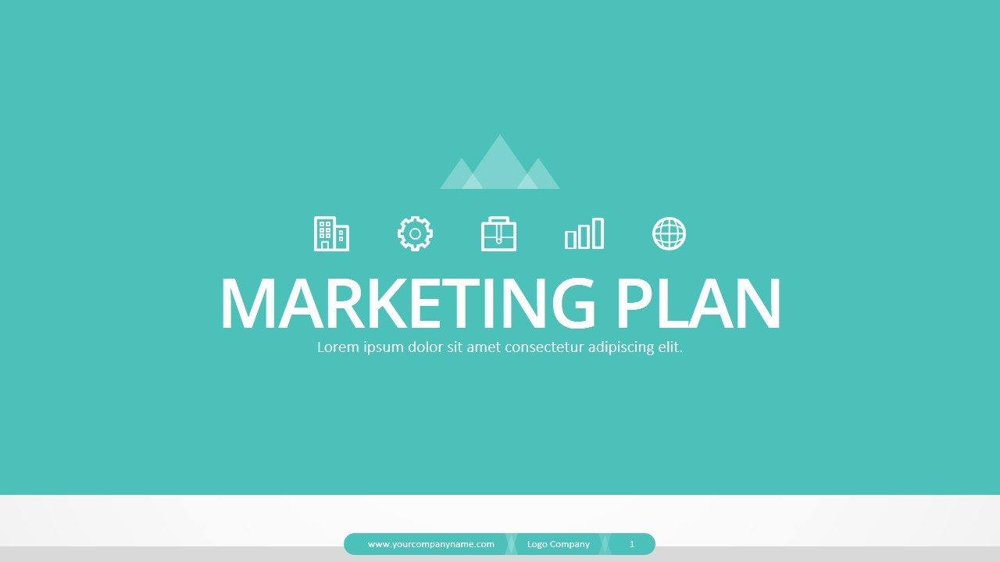

  
 

  When I was a junior in High School I took marketing. My marketing teacher put me in a group with two other 
classmates who eventually, became my teammates in the CTE competition. The competition lasted two days in which 
we were presented a company to create a marketing plan for. 
  At the competition, my teammates and I spent a whole day researching the reasons the company's sales may be 
declining and how they could increase sales. We then put together a marketing plan and presentation that we
shared the next day. Sadly, we did not place in the top three. However, the competition taught me how to 
present myself in a professional manner. The experience also taught me how to manage time and how to 
analyze data. 
