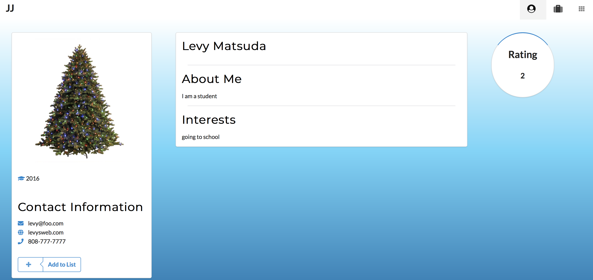

  

During my Fall Semester at University of Hawaii at Manoa, I took ICS 314 where I learned 
about Software Engineering concepts. For our final project, we were assigned to put together a web app. 
For my final project, my Team and I put together Jiffy Jobs, a webapp that allows companies and students
to find each other for job positions or internships. 

Our goal was to make the web app easy to navigate while maintaining a nice design. When you sign up, you choose
whether you are a student or a company. Students have a dashboard to view companies and companies have a dashboard to 
view students. Admins are able to monitor these accounts and can delete the accounts. Users are able to edit their
own profile and rate other companies or students. More details can be found at  [our website](https://jiffy-jobs.github.io).

